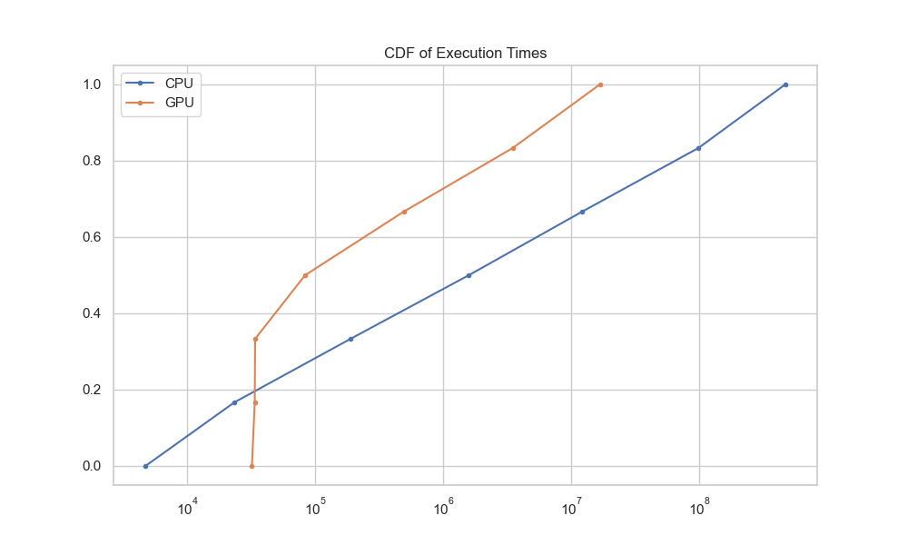
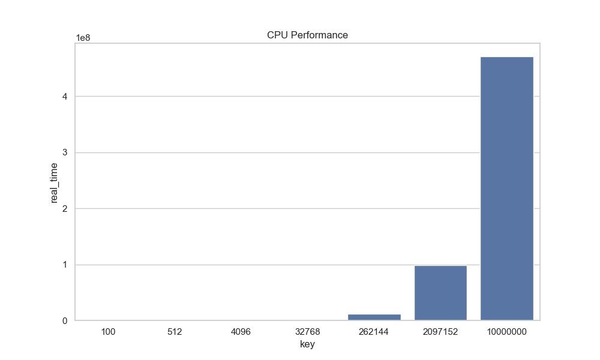
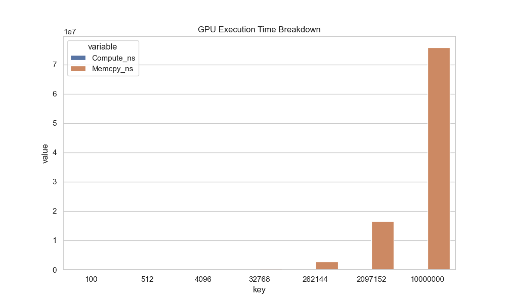
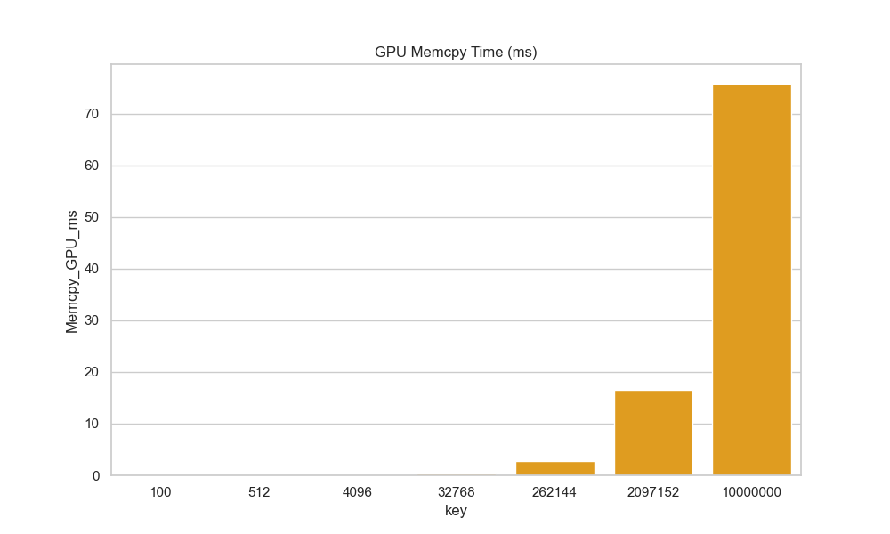
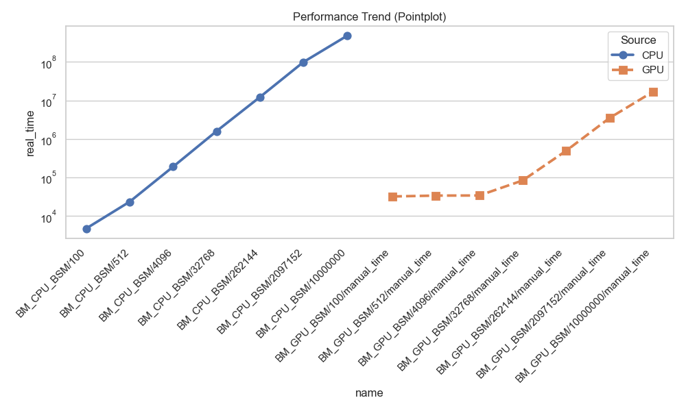
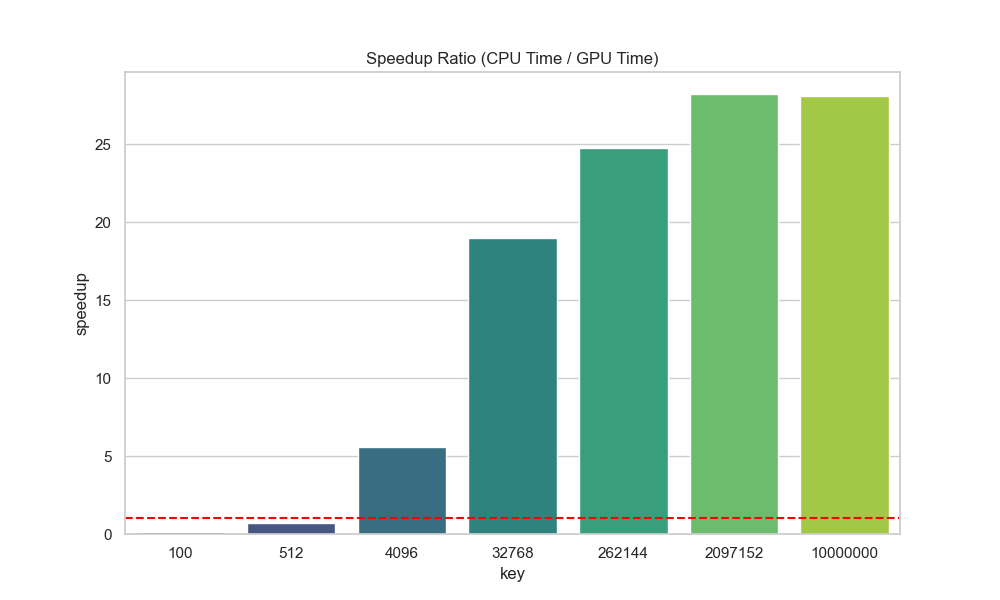

# Greeks Engine


A GPU-accelerated option pricing library in C++20. Implements the Black-Scholes-Merton model for European options, computing prices and all five major Greeks (Δ, Γ, ν, θ, ρ) on both CPU and CUDA GPU from a single codebase.

## Features

- Black-Scholes-Merton pricing for European calls and puts
- All five major Greeks: delta, gamma, vega, theta, rho
- Header-only architecture — one codebase compiles for CPU and GPU
- CUDA batch kernel: each thread independently prices one option
- CPU and GPU benchmarks via Google Benchmark (with `cudaEvent_t` timing)
- CMake auto-detects CUDA; builds CPU-only if no GPU is found

## Project Structure

```
Greeks-Engine/
├── include/
│   ├── models/
│   │   └── BSMModel.hpp        # Header-only BSM implementation (CPU + GPU)
│   ├── math/
│   │   ├── normcdf.hpp         # Normal CDF (MathUtils namespace)
│   │   └── normpdf.hpp         # Normal PDF (MathUtils namespace)
│   ├── gpu/
│   │   ├── GreeksKernel.cuh    # Kernel declaration
│   │   └── error_checking.cuh  # CUDA_CHECK macro
│   ├── Option.hpp              # Option input struct
│   └── Greeks.hpp              # Greeks output struct
├── src/
│   ├── main.cpp                # CPU entry point
│   ├── main.cu                 # GPU entry point
│   └── GreeksKernel.cu         # Kernel + bridge function implementation
├── benchmarks/
│   ├── CPUBenchmark.cpp        # Sequential CPU benchmark
│   ├── GPUBenchmark.cu         # GPU benchmark with cudaEvent timing
│   ├── setup.hpp               # Shared benchmark data generation
│   └── plot.py                 # Plots benchmark output (*_results.csv)
└── tests/
    └── bsm_tests.cpp           # Unit tests (GoogleTest)
```

## Build

**Requirements:** C++20 compiler, CMake 3.20+. CUDA Toolkit is optional — the build falls back to CPU-only if not found.

```bash
git clone https://github.com/atlasshiny/Greeks-Engine.git
cd Greeks-Engine
mkdir build && cd build
cmake ..
cmake --build . -j4
```

This produces up to four executables depending on your environment:

| Executable | Description |
|---|---|
| `GreeksEngineCPU` | CPU pricing demo |
| `GreeksEngineGPU` | GPU pricing demo (CUDA only) |
| `GreeksEngineTests` | Unit test suite |
| `cpu_benchmark` | Google Benchmark — sequential CPU |
| `gpu_benchmark` | Google Benchmark — CUDA kernel (CUDA only) |

## Usage

### CPU

```cpp
#include "models/BSMModel.hpp"

// S=100, K=100, T=1yr, r=5%, sigma=20%
BSMModel model(100.0, 100.0, 1.0, 0.05, 0.2);

double call = model.callPrice();   // 10.4506
double put  = model.putPrice();    //  5.5735

Greeks g = model.callGreeks();
// g.delta = 0.6368
// g.gamma = 0.0188
// g.vega  = 37.524
// g.theta = -6.414
// g.rho   = 53.233
```

### GPU (batch)

```cpp
#include "gpu/GreeksKernel.cuh"

std::vector<Option> options(N, {100.0, 100.0, 1.0, 0.05, 0.2, 0});
std::vector<Greeks> results(N);

// Transfers to GPU, launches kernel, copies results back
launchGreeksKernel(options.data(), results.data(), N);
```

`launchGreeksKernel` handles host-device memory management. The kernel instantiates `BSMModel` on each GPU thread — the `HOST_DEVICE` macro and header-only design make this possible without duplicating any pricing logic.

## Design Notes

**Why header-only?**
CUDA requires that any function called from a `__device__` context is visible to `nvcc` at compile time. Moving `BSMModel` entirely into a header lets the same class compile for both CPU (`g++`) and GPU (`nvcc`) without code duplication.

**Why `HOST_DEVICE` on every method?**
The `__host__ __device__` qualifiers tell `nvcc` to emit both a CPU and a GPU version of each function. The `#ifdef __CUDACC__` guard makes the macro a no-op under a standard C++ compiler, so the headers remain clean for CPU-only builds.

**Why `cudaEvent_t` for benchmarking?**
Host-side timers (`std::chrono`) include synchronization overhead that inflates GPU measurements. `cudaEvent_t` records timestamps on the GPU's command stream, giving accurate kernel-only timing. The GPU benchmark also separates `cudaMemcpy` time from compute time so both costs are visible independently.

## Benchmarks
The following results and plots were generated using an Intel i7-10700KF and RTX 5060 (8GB) on Windows 11

### CPU Benchmark
```bash
Running CPU Benchmark...
Running ..\build\benchmarks\Release\cpu_benchmark.exe
Run on (16 X 3792 MHz CPU s)
CPU Caches:
  L1 Data 32 KiB (x8)
  L1 Instruction 32 KiB (x8)
  L2 Unified 256 KiB (x8)
  L3 Unified 16384 KiB (x1)
--------------------------------------------------------------
Benchmark                    Time             CPU   Iterations
--------------------------------------------------------------
BM_CPU_BSM/100            4729 ns         4688 ns       160000
BM_CPU_BSM/512           23378 ns        23019 ns        29867
BM_CPU_BSM/4096         189501 ns       188354 ns         3733
BM_CPU_BSM/32768       1587179 ns      1604353 ns          448
BM_CPU_BSM/262144     12207609 ns     12276786 ns           56
BM_CPU_BSM/2097152    98711000 ns     98214286 ns            7
BM_CPU_BSM/10000000  471168100 ns    468750000 ns            2
```

### GPU Benchmark
```bash
Running GPU Benchmark...
Running ..\build\benchmarks\Release\gpu_benchmark.exe
Run on (16 X 3792 MHz CPU s)
CPU Caches:
  L1 Data 32 KiB (x8)
  L1 Instruction 32 KiB (x8)
  L2 Unified 256 KiB (x8)
  L3 Unified 16384 KiB (x1)
------------------------------------------------------------------------------------------
Benchmark                                Time             CPU   Iterations UserCounters...
------------------------------------------------------------------------------------------
BM_GPU_BSM/100/manual_time           32077 ns        67180 ns        21165 Memcpy_GPU_ms=0.010752
BM_GPU_BSM/512/manual_time           33755 ns        68715 ns        21147 Memcpy_GPU_ms=0.012288
BM_GPU_BSM/4096/manual_time          33997 ns       109523 ns        21685 Memcpy_GPU_ms=0.070624
BM_GPU_BSM/32768/manual_time         83493 ns       407528 ns         8435 Memcpy_GPU_ms=0.314336
BM_GPU_BSM/262144/manual_time       492734 ns      2809804 ns         1507 Memcpy_GPU_ms=2.69843
BM_GPU_BSM/2097152/manual_time     3496713 ns     20287958 ns          191 Memcpy_GPU_ms=16.6208
BM_GPU_BSM/10000000/manual_time   16772894 ns    102734375 ns           40 Memcpy_GPU_ms=75.8564
```

### Benchmark Plots







Note : The red line is the 1:1 ratio; anything above it is purely measuring GPU speedup

### Personal Benchmarking

Run against your own hardware to get meaningful numbers:

```bash
# CPU
./cpu_benchmark

# GPU (CUDA build only)
./gpu_benchmark
```

The GPU benchmark uses a warmup pass before timing begins to exclude CUDA driver initialization from measurements.

## Known Limitations

- **European options only** — no early exercise; American options require a binomial tree or finite difference solver
- **Constant volatility** — BSM assumes σ is fixed; where stochastic volatility models (like Heston) would be more realistic
- **No calibration** — implied volatility solving and surface fitting are not implemented

## Planned Extensions

- American Options pricing (via Binomial Tree)
- Monte Carlo pricing (for exotic options)

## References

- Black, F. & Scholes, M. (1973). *The Pricing of Options and Corporate Liabilities*. Journal of Political Economy.
- NVIDIA CUDA Programming Guide — [docs.nvidia.com/cuda](https://docs.nvidia.com/cuda/cuda-c-programming-guide/)
- Google Benchmark — [github.com/google/benchmark](https://github.com/google/benchmark)
