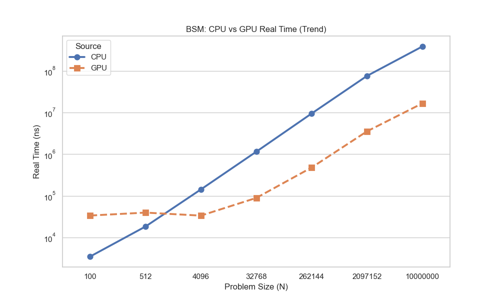
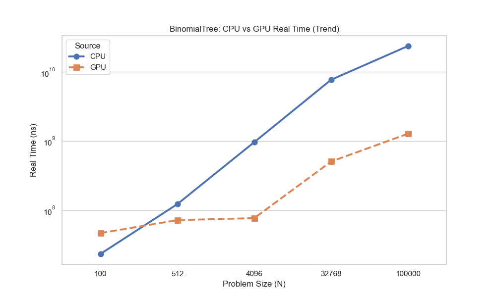

# Greeks Engine


A GPU-accelerated option pricing library in C++20. Implements the Black-Scholes-Merton model for European options and the Binomial Tree model for American options, computing prices and all five major Greeks (Δ, Γ, ν, θ, ρ) on both CPU and CUDA GPU from a single  header-only codebase.

## Features

- Prices European calls and puts with the Black-Scholes-Merton model.
- Prices European and American options with the binomial tree model.
- Computes the major Greeks exposed by each model.
- Provides CPU and GPU executable entry points from the same codebase.
- Includes GoogleTest unit tests and Google Benchmark benchmarks.
- CMake auto-detects CUDA; builds CPU-only if no GPU is found

## Project Structure

```
Greeks-Engine/
├── include/
│   ├── Greeks.hpp
│   ├── MarketParameters.hpp
│   ├── Option.hpp
│   ├── macros.hpp
│   ├── math/
│   │   ├── normcdf.hpp
│   │   └── normpdf.hpp
│   ├── models/
│   │   ├── BSMModel.hpp
│   │   ├── BinomialTreeModel.hpp
│   │   └── MonteCarloModel.hpp
│   └── gpu/
│       ├── BSMKernel.cuh
│       ├── BinomialTreeKernel.cuh
│       └── error_checking.cuh
├── src/
│   ├── main.cpp
│   ├── main.cu
│   └── gpu/
│       ├── BSMKernel.cu
│       └── BinomialTreeKernel.cu
├── benchmarks/
│   ├── CPUBenchmark.cpp
│   ├── GPUBenchmark.cu
│   ├── plot.py
│   ├── setup.hpp
│   ├── cpu_results.csv
│   └── gpu_results.csv
├── tests/
│   ├── bsm_tests.cpp
│   └── binomial_tree_tests.cpp
└── diagrams/
    ├── BSM/
    └── BinomialTree/
```

## Build

***Requirements:** C++20 compiler, CMake 3.20+. CUDA Toolkit is optional — the build falls back to CPU-only if not found.

```bash
git clone https://github.com/atlasshiny/Greeks-Engine.git
cd Greeks-Engine
mkdir build && cd build
cmake ..
cmake --build . -j4
```

This produces up to five executables depending on your environment:

| Executable | Description |
|---|---|
| `GreeksEngineCPU` | CPU demo that prints BSM and binomial-tree outputs |
| `GreeksEngineGPU` | CUDA demo that runs the batch GPU implementations |
| `GreeksEngineTests` | GoogleTest suite for the pricing models |
| `cpu_benchmark` | Google Benchmark target for sequential CPU pricing |
| `gpu_benchmark` | Google Benchmark target for CUDA kernel GPU pricing |

## Running

The exact executable path depends on your CMake generator and build configuration. After building, run the demo targets from the build tree.

### CPU Demo

Runs the default BSM and binomial tree examples from [src/main.cpp](src/main.cpp).

### GPU Demo

Runs the batch BSM and binomial tree examples from [src/main.cu](src/main.cu) when CUDA is available.

### Tests

Use CTest or the generated test executable from the build tree.

## Benchmarks
The benchmark sources live in [benchmarks/CPUBenchmark.cpp](benchmarks/CPUBenchmark.cpp) and [benchmarks/GPUBenchmark.cu](benchmarks/GPUBenchmark.cu). The plotting helper is [benchmarks/plot.py](benchmarks/plot.py). 

The following results and plots were generated using an Intel i7-10700KF and RTX 5060 (8GB) on Windows 11.

### High-Level Benchmark Plots


For a more in-depth benchmark review, visit the .

## Notes

- `BSMModel` is the most mature path and is used by the main pricing examples and tests.
- `BinomialTreeModel` supports pricing and finite-difference Greeks, but it is more computationally expensive.
- While `BSMModel` is bottlenecked by memory transfers, `BinomialTreeModel` is bottlenecked by expensive calculations (backed by a NVIDIA Nsight Systems & Compute profile of the code as well as the benchmarking results).
- `BinomialTreeModel` takes in a buffer as a place to house all of the data needed when calculating the tree. It is passed in manually for CUDA compatability (since for cuda, it is convenient and more performance-efficient to pass in small buffer versus just initializing the buffer internally)
- The `secondCentralDifference` method in `BinomialTreeModel` uses a square-rooted value instead of the raw value to help keep the math stable.

## Known Limitations

- **Constant volatility** — BSM assumes σ is fixed; where stochastic volatility models (like Heston) would be more realistic
- **No calibration** — implied volatility solving and surface fitting are not implemented

## Planned Extensions
- Monte Carlo pricing (for exotic options)
- Implied volatility solver (starting with the solver and then potentially moving to a surface)
- Hardening math for edge cases such as div by zero, div by infinity, ect.
- Swapping kernel math functions for intrisic CUDA functions (Note that accuracy could fall in this swap and that why it hasn't happened yet)

## Design Notes

**Why header-only?**
CUDA requires that any function called from a `__device__` context is visible to `nvcc` at compile time. Moving `BSMModel` entirely into a header lets the same class compile for both CPU (`g++`) and GPU (`nvcc`) without code duplication.

**Why `HOST_DEVICE` on every method?**
The `__host__ __device__` qualifiers tell `nvcc` to emit both a CPU and a GPU version of each function. The `#ifdef __CUDACC__` guard makes the macro a no-op under a standard C++ compiler, so the headers remain clean for CPU-only builds.

## References

- Black, F. & Scholes, M. (1973). *The Pricing of Options and Corporate Liabilities*. Journal of Political Economy.
- NVIDIA CUDA Programming Guide — [docs.nvidia.com/cuda](https://docs.nvidia.com/cuda/cuda-c-programming-guide/)
- Google Benchmark — [github.com/google/benchmark](https://github.com/google/benchmark)
